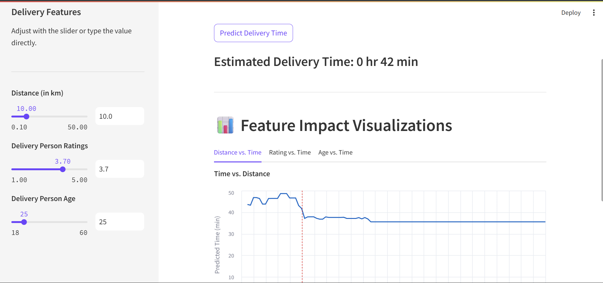

# 🚲 Delivery Time Prediction App

A web application built with **Streamlit** that predicts food delivery time based on several features. The app also provides **interactive visualizations** to help understand the impact of each feature on the final prediction.

---

## Features

- **Real-time Prediction:** Get an estimated delivery time in **hours and minutes** based on your inputs.
- **Interactive UI:** Use sliders and number inputs to set feature values.
- **Feature Impact Analysis:** Interactive charts show how changes in one feature affect delivery time while others are held constant.
- **Modular Codebase:** Clean separation between user interface, model handling, and plotting logic.

---

## Technologies Used

- **Python:** Core programming language.
- **Streamlit:** For building the interactive web app.
- **Scikit-learn:** For using the Random Forest Regressor model.
- **Pandas:** For data manipulation and DataFrame creation.
- **NumPy:** For numerical operations.
- **Joblib:** For loading the pre-trained `.pkl` model.
- **Altair:** For declarative and interactive visualizations.

---
.
├── delivery_app.py         # Main Streamlit application
├── delivery_time_model.pkl # Pre-trained ML model
├── requirements.txt        # Python dependencies
├── README.md               # Project description and instructions
└── app_screenshot.png      # Screenshot of the running app

